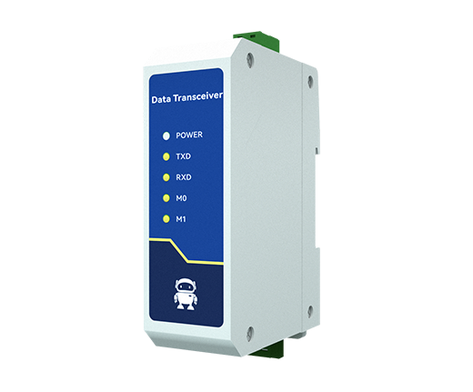

# Python library to control XY Screens and See Max projector screens and lifts

![Python][python-shield]
[![GitHub Release][releases-shield]][releases]
[![Licence][license-shield]][license]
[![Maintainer][maintainer-shield]][maintainer]  
[![Github Sponsors][github-shield]][github]
[![PayPal][paypal-shield]][paypal]
[![BuyMeCoffee][buymecoffee-shield]][buymecoffee]
[![Patreon][patreon-shield]][patreon]

## Introduction

This python library lets you control XY Screens and See Max projector screens and lifts over the
serial and RS-485 interface, or via TCP network connections using RS-485-to-Ethernet converters.

This python library was first implemented for XY Screens. After I was informed that the See Max
devices use a very similar protocol support for these devices has been added.

[XY Screens](https://www.xyscreen.com/) and See Max are OEM manufacturers of projector screens and
lifts, their devices are sold around the world under various brand names.

## Features

- Position control, move the screen/lift to any position along the way
- Program device address on devices that support this
- Use multiple devices on the same RS-485 interface
- **Serial and TCP connections** - Connect via USB RS-485 adapters or RS-485-to-Ethernet converters
- **Direct TCP support** - No need for socat or virtual serial ports when using RS-485-to-Ethernet converters
- Synchronous and asynchronous methods
- Uses Callbacks for asynchronous methods

### About position control

The XY Screens and See Max projector screens and lifts do not provide any positional feedback. The
state of the screen is thus always an assumed one. The screen position is calculated based on the
time the cover has moved and the configured up and down durations. This results in a potential
error margin. Every time the screen reaches it maximum up or down position the position and thus
any potential error is reset accordingly. If the screen is controlled outside the library, for
instance with the remote control, the screen position and state will no longer represent the actual
state.

## Hardware

### Serial Connection (USB RS-485)

I use a cheap USB RS-485 controller to talk to the projector screen where position 5 of the RJ25
connector is connected to D+ and position 6 to the D-.


### Network Connection (RS-485-to-Ethernet)

Alternatively, you can use an RS-485-to-Ethernet converter to connect your screen to your network.
This eliminates the need for a direct serial connection and allows remote control over TCP/IP.




Compatible and tested Converters:
* [ebyte NA111-E](https://www.cdebyte.com/products/NA111/4#Downloads)

Configure your converter with these settings:
- **Baud Rate**: 2400
- **Data Bits**: 8
- **Parity**: None
- **Stop Bits**: 1
- **TCP Server Mode** with your chosen port (commonly 9997)

See the documentation of your specific device on how to wire yours correctly.

## Protocol

If your devices follows the following protocol it's supported by this Python library:

2400 baud 8N1  
Up command  : `0xFF 0xXX 0xXX 0xXX 0xDD`  
Down command: `0xFF 0xXX 0xXX 0xXX 0xEE`  
Stop command: `0xFF 0xXX 0xXX 0xXX 0xCC`

Where `0xXX 0xXX 0xXX` is the three byte address of the device.

For XY Screens devices the default address is `0xAA 0xEE 0xEE`, while for See Max devices the default
address is `0xEE 0xEE 0xEE`.

## Supported projector screens and lifts

The following projector screen is known to work:

- iVisions Electro M Series

The following projector screens and lifts are not tested but use the same protocol according to the
documentation:

XY Screens:
- iVisions Electro L/XL/Pro/HD Series
- iVisions PL Series projector lift
- Elite Screens
- KIMEX
- DELUXX
- Telon

See Max:
- ScreenPro
- Monoprice
- Grandview
- Dragonfly
- WS Screens
- Cirrus Screens
- Lumien
- Celexon

Please let me know if your projector screen or projector lift works with this Python library so I
can improve the overview of supported projector screens and lifts.

## Installation

You can install the Python XY Screens library using the Python package manager PIP:

`pip3 install xyscreens`

## Usage

### Python API

The library provides both synchronous and asynchronous methods for controlling your screen or lift.

#### Creating a connection

The XYScreens constructor automatically detects whether you're using a serial or TCP connection:

```python
from xyscreens import XYScreens

# Serial connection
screen = XYScreens("/dev/ttyUSB0", b"\xAA\xEE\xEE", 30, 30)

# TCP connection (using RS-485-to-Ethernet converter)
screen = XYScreens("192.168.1.100:9997", b"\xAA\xEE\xEE", 30, 30)
```

#### Synchronous usage

```python
# Move screen down for 10 seconds
screen.down(10)

# Move screen up for 15 seconds
screen.up(15)

# Stop the screen
screen.stop()

# Move to specific position (0-100, where 0 is fully closed)
screen.set_position(50)  # Move to 50% position
```

#### Asynchronous usage

```python
import asyncio
from xyscreens import XYScreens

async def control_screen():
    screen = XYScreens("192.168.1.100:9997", b"\xAA\xEE\xEE", 30, 30)

    # Move screen down for 5 seconds, then stop, then up
    await screen.async_down(5)
    await screen.async_stop()
    await screen.async_up(5)

    # Move to specific position
    await screen.async_set_position(75)

# Run the async function
asyncio.run(control_screen())
```

#### Using callbacks

```python
def screen_callback(state, position):
    print(f"Screen state: {state}, Position: {position}%")

screen = XYScreens("192.168.1.100:9997", b"\xAA\xEE\xEE", 30, 30)
screen.add_callback(screen_callback)

# Now any screen movement will trigger the callback
screen.down(10)
```

## `xyscreens` CLI

You can use the Python XY Screens library directly from the command line to move your screen up or
down or to stop the screen using the following syntax:

### Serial Connection
Move the screen down: `python3 -m xyscreens <serial port> <address> down <duration>`
Stop the screen: `python3 -m xyscreens <serial port> <address> stop`
Move the screen up: `python3 -m xyscreens <serial port> <address> up <duration>`

### TCP Network Connection
Move the screen down: `python3 -m xyscreens <host>:<port> <address> down <duration>`
Stop the screen: `python3 -m xyscreens <host>:<port> <address> stop`
Move the screen up: `python3 -m xyscreens <host>:<port> <address> up <duration>`

### Parameters
- `<serial port>`: Serial device path (e.g., `/dev/ttyUSB0`, `COM1`)
- `<host>:<port>`: TCP endpoint (e.g., `192.168.1.100:9997`)
- `<address>`: Six character hexadecimal (three bytes) address of the device
- `<duration>`: Optional time in seconds to move the screen up or down

For XY Screens devices the default address is `AAEEEE`, while for See Max devices the default
address is `EEEEEE`. If you have reprogrammed the device address use the according address.

### Examples
```bash
# Serial connection examples
python3 -m xyscreens /dev/ttyUSB0 AAEEEE down 30
python3 -m xyscreens COM1 EEEEEE stop

# TCP connection examples
python3 -m xyscreens 192.168.1.100:9997 AAEEEE up 25
python3 -m xyscreens 10.0.0.50:8080 EEEEEE stop
```

### Programming the device address

Some See Max projector screens and lifts which use the RS-485 interface seem to allow to program
the device address. This way multiple devices can be connected to the same RS-485 interface. Each
device should have a unique address.

**Serial connection:**
`python3 -m xyscreens <serial port> <address> program`

**TCP connection:**
`python3 -m xyscreens <host>:<port> <address> program`

Where `<address>` is the to be programmed three byte address.

#### Examples
```bash
# Program address via serial connection
python3 -m xyscreens /dev/ttyUSB0 123456 program

# Program address via TCP connection
python3 -m xyscreens 192.168.1.100:9997 123456 program
```

### Troubleshooting

You can add the `--debug` flag to any CLI command to get more details on what's going on. Like so:

```bash
# Debug serial connection
python3 -m xyscreens /dev/ttyUSB0 AAEEEE down 30 --debug

# Debug TCP connection
python3 -m xyscreens 192.168.1.100:9997 AAEEEE down 30 --debug
```

## Support my work

Do you enjoy using this Python library? Then consider supporting my work using one of the following
platforms, your donation is greatly appreciated and keeps me motivated:

[![Github Sponsors][github-shield]][github]
[![PayPal][paypal-shield]][paypal]
[![BuyMeCoffee][buymecoffee-shield]][buymecoffee]
[![Patreon][patreon-shield]][patreon]

## Hire me

If you're in need for a freelance Python developer for your project please contact me, you can find
my email address on [my GitHub profile](https://github.com/rrooggiieerr).

[python-shield]: https://img.shields.io/badge/python-3670A0?style=for-the-badge&logo=python&logoColor=ffdd54
[releases]: https://github.com/rrooggiieerr/xyscreens.py/releases
[releases-shield]: https://img.shields.io/github/v/release/rrooggiieerr/xyscreens.py?style=for-the-badge
[license]: ./LICENSE
[license-shield]: https://img.shields.io/github/license/rrooggiieerr/xyscreens.py?style=for-the-badge
[maintainer]: https://github.com/rrooggiieerr
[maintainer-shield]: https://img.shields.io/badge/MAINTAINER-%40rrooggiieerr-41BDF5?style=for-the-badge
[paypal]: https://paypal.me/seekingtheedge
[paypal-shield]: https://img.shields.io/badge/PayPal-00457C?style=for-the-badge&logo=paypal&logoColor=white
[buymecoffee]: https://www.buymeacoffee.com/rrooggiieerr
[buymecoffee-shield]: https://img.shields.io/badge/Buy%20Me%20a%20Coffee-ffdd00?style=for-the-badge&logo=buy-me-a-coffee&logoColor=black
[github]: https://github.com/sponsors/rrooggiieerr
[github-shield]: https://img.shields.io/badge/sponsor-30363D?style=for-the-badge&logo=GitHub-Sponsors&logoColor=ea4aaa
[patreon]: https://www.patreon.com/seekingtheedge/creators
[patreon-shield]: https://img.shields.io/badge/Patreon-F96854?style=for-the-badge&logo=patreon&logoColor=white
